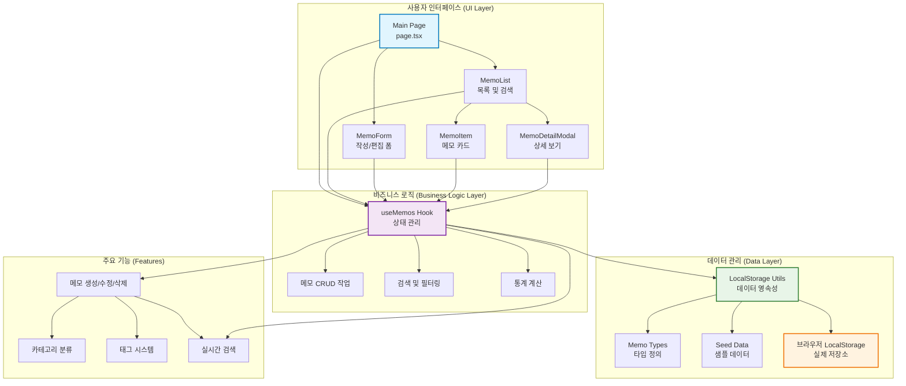

# 메모 앱 시스템 아키텍처

## 개요

메모 앱은 Next.js 기반의 클라이언트 사이드 애플리케이션으로, 로컬스토리지를 활용한 메모 관리 시스템입니다. 컴포넌트 기반 아키텍처와 커스텀 훅을 통한 상태 관리로 구성되어 있습니다.

## 다이어그램

## 설명

### 1. 사용자 인터페이스 계층 (UI Layer)

- **Main Page (`page.tsx`)**: 애플리케이션의 진입점으로 전체 레이아웃과 상태를 관리
- **MemoList**: 메모 목록 표시, 검색 및 카테고리 필터링 기능 제공
- **MemoForm**: 새 메모 작성 및 기존 메모 편집을 위한 모달 폼
- **MemoItem**: 개별 메모를 카드 형태로 표시하는 컴포넌트
- **MemoDetailModal**: 메모의 상세 내용을 확인할 수 있는 모달

### 2. 비즈니스 로직 계층 (Business Logic Layer)

- **useMemos Hook**: 메모 관련 모든 상태와 로직을 캡슐화한 커스텀 훅
  - 메모 CRUD 작업 (생성, 읽기, 업데이트, 삭제)
  - 검색 및 카테고리 필터링
  - 통계 정보 계산 (총 메모 수, 카테고리별 분포 등)

### 3. 데이터 관리 계층 (Data Layer)

- **LocalStorage Utils**: 브라우저 로컬스토리지와의 인터페이스 제공
- **Memo Types**: TypeScript 타입 정의로 데이터 구조 보장
- **Seed Data**: 초기 샘플 데이터 제공
- **Browser LocalStorage**: 실제 데이터가 저장되는 브라우저 저장소

### 4. 주요 기능 (Features)

- **메모 관리**: 생성, 수정, 삭제 기능
- **카테고리 시스템**: 개인, 업무, 학습, 아이디어, 기타로 분류
- **태그 시스템**: 자유로운 태그 추가 및 관리
- **실시간 검색**: 제목, 내용, 태그 기반 즉시 검색

## 데이터 플로우

1. **메모 생성**: 사용자 입력 → MemoForm → useMemos → LocalStorage Utils → LocalStorage
2. **메모 조회**: LocalStorage → LocalStorage Utils → useMemos → UI Components
3. **검색/필터링**: 사용자 입력 → useMemos (클라이언트 사이드 필터링) → UI 업데이트
4. **상태 동기화**: LocalStorage 변경 → React State 업데이트 → UI 리렌더링

## 기술 스택

- **Frontend**: Next.js 14, React 18, TypeScript
- **상태 관리**: React Hooks (useState, useEffect, useMemo, useCallback)
- **스타일링**: Tailwind CSS
- **데이터 저장**: Browser LocalStorage
- **빌드 도구**: Next.js Built-in Bundler

## 참고사항

- 클라이언트 사이드 전용 애플리케이션으로 서버 의존성 없음
- 로컬스토리지 기반으로 오프라인에서도 동작 가능
- 반응형 디자인으로 모바일 및 데스크톱 지원
- 컴포넌트 기반 아키텍처로 높은 재사용성과 유지보수성 확보